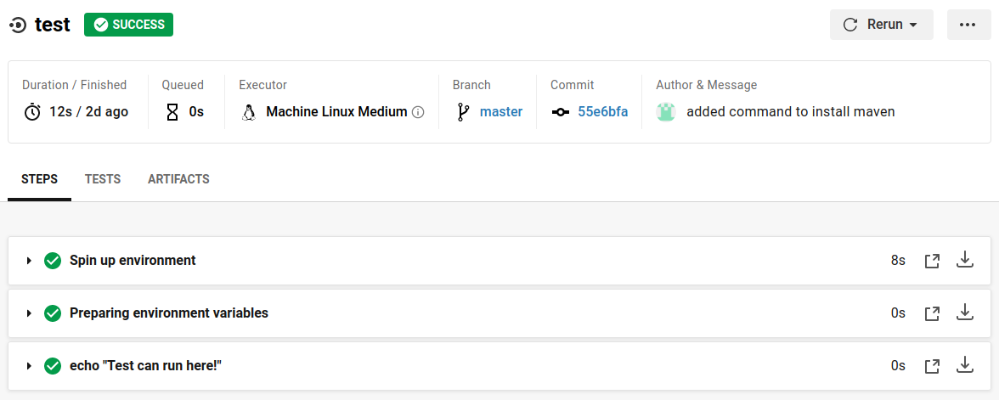

# **What Are Thooose? Trainer Inventory**

## **Contents**

* ### [Brief](#Brief)
  * ### [Scope](#Scope)
* ### [My Approach](#Approach)
* ### [Design](#Design)
  * ### [Kanban Board](#Architecture)
* ### [Creation](#Creation)

## **Brief**

The brief for this project is to create a CRUD application using the supporting tools, methodologies and technologies that encapsulate all core modules covered during training.

### **Scope**

The following requirements also need to be implemented:

* A Jira Kanban Board with full expansion on user stories, use cases and tasks needed to complete the project.

* Clear documentation from a design phase describing the architecture used.

* A detailed risk assessment.

* A relational database used to store data for the project.

* The application must have a functioning front-end website and integrated API. 

* Code fully integrated into a Version Control System

### **Approach**

To meet the scope I have decided to create a simple inventory where users will be able to do the following:

* Add entries that will include:
  * Shoe name
  * Shoe size
  * Brand
  * Colour
* Users will also be allowed to:
  * View, edit or delete entries

## **Design**

### **Kanban Board**

A Kanban board was used to track issues that needed to be completed for the purpose of completing the application. Epics were created that included issues, stories and tasks. These were arranged based on the issue they related to. Below is a quick screenshot of my Kanban Board in use.  

  

### **Entity Relationship Diagram**

The Entity Relationship Diagram shows the structure of my database below: 

There is a One-to-Many relationship between the Brand and Shoes entities. This allows a user to add many different shoes to one brand. 

## **Creation**

To build this project a number of different technologies were used:

### Database

A Google Cloud Platform SQL Server

### Back-end

Spring Boot, which is a Java based framework, was used to build the back-end of the application. Forms created in the Front-end of the application were used to send data to the SQL server to be input into the correct tables. 

### Front-end

The Front-end of the application is basic at this stage and only features standard HTML and a Bootstrap navigation bar. The navigation is the same across all pages. 

### Version Control

The version control system used for this project was Git. A repository was created for the project, which acted as a central point for any project source code. After any changes were made to code and tested, changes were staged and then pushed to the master branch.  

### CI Server

Pictured above is the Continuous Integration/Continuous Development (CI/CD) Pipeline. Due to the integration process being automated, development-to-deployment is quick and simple. 

Code on my machine is pushed to the Git repository. CircleCI then pulls code from the repository via a webhook and applies automated testing. Once testing has passed successfully, the deployment of the web application is triggered. 

There are specific steps in the pipeline job that all need to pass for the build to be successful. 

All steps in the test job need to be successful before the deployment job starts. 

Once all steps in the deployment job pass, the build will complete totally and then the application is pushed to a Google Cloud VM for deployment. (If yaml is fixed, add screenshots for google VM and of application at host)

### Cloud Server

